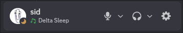
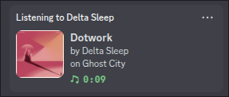

# Scrobblecord

## What?

This app shows the song you're currently scrobbling as your Discord activity,
similarly to how it would've looked like if you had Spotify account connected.





## What operating systems are supported?

- Linux
- Hopefully Windows and Mac (not tested)

## How do I use it?

- Get your Last.fm API key and secret [here](https://www.last.fm/api/account/create).
- Export environment variables `SCROBBLECORD_LASTFM_API_KEY` and `SCROBBLECORD_LASTFM_API_SECRET`:

```
export SCROBBLECORD_LASTFM_API_KEY="insert your key here"
export SCROBBLECORD_LASTFM_API_SECRET="insert your secret here"
```

- Run the program passing your Last.fm username as an argument: `scrobblecord skill_issue_dev`
